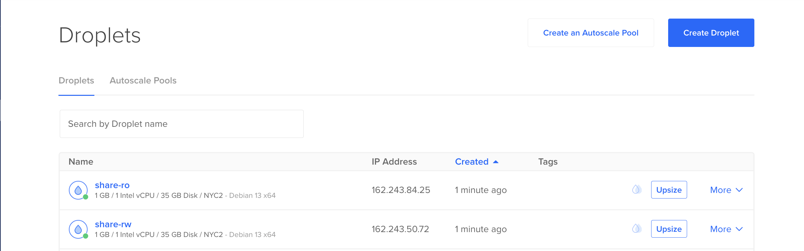
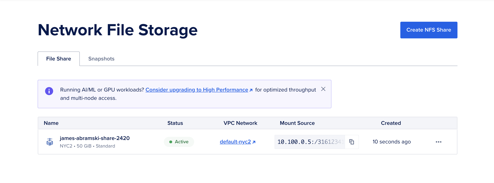
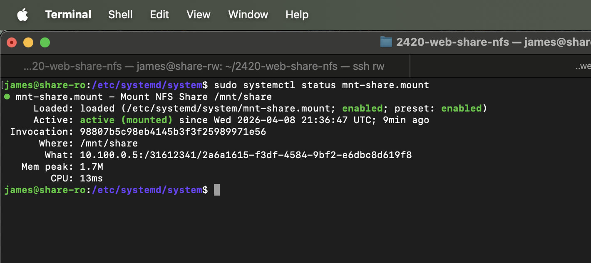
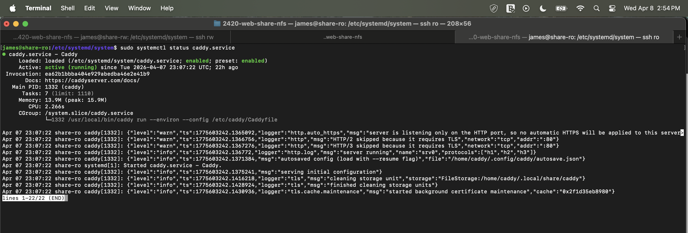
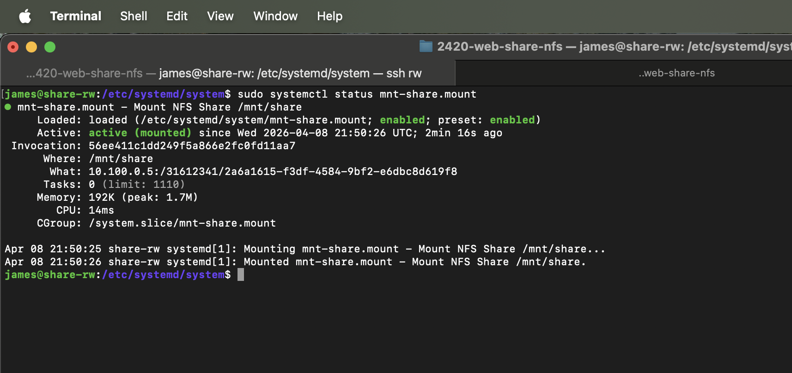
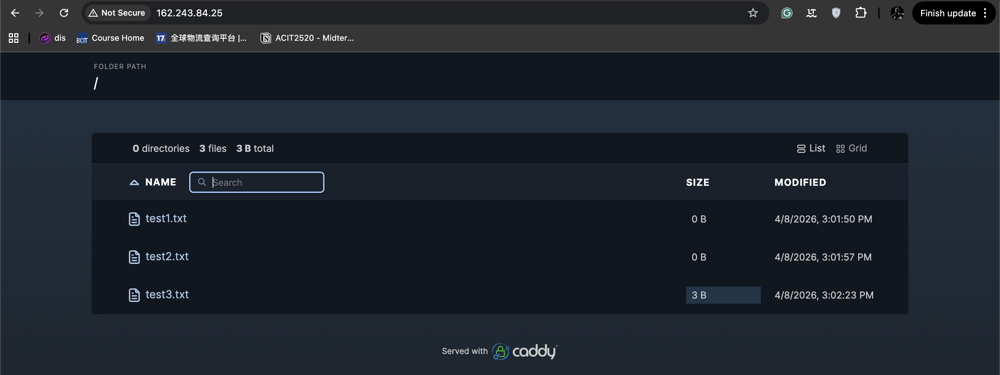

<h1>Week 13 Lab </h1>


## Your completed cloud-config.yaml file. This should be added to the readme as a code block that has yaml syntax highlighting.

```yaml
#cloud-config
# You will need to edit this file before creating your new servers
users:
  - name: james
    primary_group: james  #same as user-name
    groups: sudo
    shell: /bin/bash
    sudo: ['ALL=(ALL) NOPASSWD:ALL']
    ssh-authorized-keys:
      - ssh-ed25519 AAAAC3NzaC1lZDI1NTE5AAAAIGeq2br8eT429NJ127kqYMxKEKQRnt9cfHDMYZk9+6cY

write_files:
  - owner: root:root
    path: /etc/caddy/Caddyfile
    content: |
      :80 {
        root * /mnt/share
        file_server browse
      }

package_update: true
package_upgrade: true

packages:
  - ripgrep
  - rsync
  - git 
  - nfs-common
  # add necessary packages to complete the exercise. Git and nfs package.

disable_root: true

runcmd:
  - sed -i -e '/^PermitRootLogin/s/^.*$/PermitRootLogin no/' /etc/ssh/sshd_config
  - systemctl restart ssh
  - useradd -rmd /home/caddy -s /usr/sbin/nologin caddy
  - mkdir -p /mnt/share
```

## Your completed mount file (the ro option file). This should be added to the readme as a code block that has ini syntax highlighting.

```ini
[Unit]
Description=Mount NFS Share /mnt/share
After=network-online.target
Wants=network-online.target

[Mount]
What=10.100.0.5:/31612341/2a6a1615-f3df-4584-9bf2-e6dbc8d619f8 
Where=/mnt/share
Type=nfs
Options=nconnect=8,ro
TimeoutSec=30

[Install]
WantedBy=multi-user.target
```

## A screenshot of the DigitalOcean web console that shows both Droplets were successfully created.



## A screenshot of the DigitalOcean web console that shows that the Network File Storage was successfully created. 



## systemctl status screenshots (3 screenshots) 

### ro screenshot status mount



### ro screenshot status caddy



### rw screenshot status mount




## Screenshot of file server caddy 


